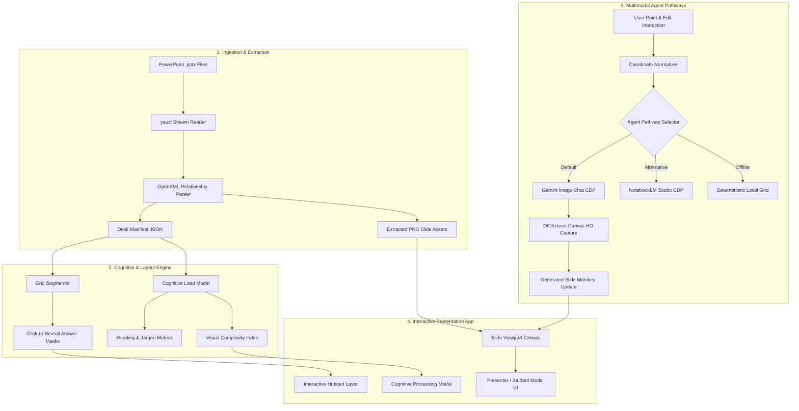

# ✦ Vibe Deck Agent · PPTX-to-Interactive Web Presentation System

[](https://pptpresentationtowebagent.vercel.app)
[](https://nodejs.org/)
[](https://expressjs.com/)
[](https://playwright.dev/)
[](https://gemini.google.com/)
[](https://notebooklm.google.com/)
[](test/presentation-agent.test.js)
[]()
[](LICENSE)

> 🚀 **Live Demo on Vercel**: [https://pptpresentationtowebagent.vercel.app](https://pptpresentationtowebagent.vercel.app)
>
> **An agentic, multimodal AI system and modern web platform that ingests whole-slide image PowerPoint presentations (`.pptx`), extracts visual and semantic components, models cognitive processing complexity, and orchestrates live AI-driven slide revisions and interactive reveal sequences.**

---

## 🌟 Executive Summary

Traditional slide decks—particularly AI-generated or image-exported presentations—are static, monolithic, and lack instructional interactivity. **Vibe Deck Agent** bridges the gap between static whole-slide graphics and dynamic, research-backed digital learning environments.

By integrating **OpenXML binary parsing**, **Playwright Chrome DevTools Protocol (CDP) agent automation**, **Google Gemini multimodal vision/image generation**, and a **cognitive load estimation engine based on published psychophysics research**, this system automatically transforms passive slide decks into interactive web applications with click-to-reveal retrieval grids, progressive build animations, and targeted point-and-edit generative AI capabilities.

```
┌─────────────────┐       ┌──────────────────────┐       ┌────────────────────────┐
│  Static .PPTX   │ ────> │ OpenXML Decompression│ ────> │  Multimodal Analysis   │
│  Slide Decks    │       │ & Relationship Graph │       │  & Spatial Coordinate  │
└─────────────────┘       └──────────────────────┘       │  Grounding (Gemini)    │
                                                                     │
┌─────────────────────────┐       ┌──────────────────────┐          │
│ Full-Featured Web App   │ <──── │ Cognitive Processing │ <────────┘
│ (Presenter/Student UI,  │       │ & Complexity Engine  │
│ Hotspots, Serial Builds)│       │ (Rosenholtz/Sweller) │
└─────────────────────────┘       └──────────────────────┘
```

---

## 🚀 Key Engineering Highlights

### 1. 🧠 Academic Cognitive Load & Visual Complexity Index (VCI)
Implements a computational model of human visual processing and working memory burden based on foundational psychophysics and educational psychology literature:
- **Visual Gist Perception**: Baseline ~250ms visual gist acquisition ([Potter, 1976](https://doi.org/10.3758/BF03204221)).
- **Feature Congestion & Visual Clutter**: Non-linear visual search latency modeling based on spatial zone counts and clutter density ([Rosenholtz et al., 2007](https://doi.org/10.1167/7.2.17)).
- **Lexical & Jargon Processing**: Dynamic reading rate scaled by domain-specific scientific vocabulary density (e.g., *mitochondria*, *eukaryote*, *magnification*).
- **Schema Decoding & Active Recall**: Mathematical formula decoding penalties and retrieval practice cognitive integration times ([Sweller, 1988](https://doi.org/10.1207/s15516709cog1202_4); [Donderi, 2006](https://doi.org/10.1037/h0087080); [Mayer, 2021](https://doi.org/10.1017/9781108894333)).

### 2. 🎯 Precision "Point & Edit" Spatial Grounding
- **Visual Coordinate Normalization**: Allows users to click, drag, and resize bounding boxes directly on top of high-resolution rendered slide canvases.
- **Spatially Grounded Prompt Synthesis**: Converts pixel interactions into normalized percentage boundaries (`left`, `top`, `width`, `height`) and anchor points passed to Google Gemini to restrict generative revisions strictly to the selected component while preserving typography, colors, and layout fidelity.

### 3. 🎬 Dynamic Serial Build Animations & Active Retrieval Grids
- **Reviewed Question Reveals**: Deck-specific starter grids and question slides use precise `unmask` or generated-answer `overlay` regions; related regions can be grouped so one answer never leaks through another mask.
- **Gemini Still-Image Cells**: Every non-video slide except the reviewed six-box starter grids receives 1–3 density-aware, cumulative, full-canvas image prompts. Clear question slides use a question-only image followed by cumulative answer images. There are no spotlight, dimming, crop, or focus-box fallbacks.
- **QA-Gated Playback**: Generated images remain private planning assets until every cell in the slide passes file validation and an explicit visual checklist (full canvas, style match, cumulative content, legibility, and no focus treatment). The complete approved set is then added atomically to the click sequence.
- **Protected Video Routing**: Existing or newly detected Gemini videos take precedence over automatic image decomposition. Video URLs, posters, ordering, and segment timings survive regeneration, clearing, and PPTX reconversion.

### 4. 🔄 Multi-Pathway Agent Orchestration & Resilient Fallbacks
Architected with a multi-tiered fallback strategy:
1. **Google Gemini Image Chat (Primary)**: Browser CDP agent orchestrating live authenticated sessions at `gemini.google.com` to upload source slide media and generate contextual revisions.
2. **NotebookLM Slide Studio (Secondary)**: CDP automation for automated prompt injection into Google NotebookLM slide studio decks.
3. **Local Spatial Segmentation (Offline Fallback)**: Deterministic, sub-millisecond local grid segmentation and bounding box heuristics guaranteeing zero downtime.

### 5. 📦 High-Performance Streaming PPTX Ingestion Engine
- Unzips `.pptx` archives via streaming chunks using `yauzl` without loading complete archives into memory.
- Traverses OpenXML XML relationship structures (`ppt/slides/_rels/slide*.xml.rels`) to map logical slide hierarchy to raw embedded PNG/JPEG media assets.
- Automatically compiles JSON manifests with metadata, dimensions, and interactive element maps.

### 6. 💎 Modern, Production-Grade Web Presentation Platform
- **Zero-Dependency Frontend**: High-performance Vanilla JavaScript and CSS (no React or Tailwind bloat) for 60fps animations and immediate load times.
- **Presenter & Student Modes**: Dedicated presentation controls for instructors and clean study modes for students.
- **Interactive Practical Simulators & Web Embeds**: Fullscreen iframe integration for digital microscopy and virtual laboratory experiments.
- **Complete Input Control**: Keyboard shortcuts (Arrows, Space, `T` for sidebar, `F` for fullscreen, `↑`/`↓` for build steps) and touch swipe gestures.
- **Non-Destructive Version Control**: Full revision history tracking with single-click rollbacks to original or intermediate slide states.

---

## 🏛️ System Architecture



---

## 🔬 Cognitive Processing Model (Mathematical Formulation)

The cognitive processing model computes the estimated audience processing time $T_{\text{total}}$ and Visual Complexity Index (VCI) using the following parameters:

$$T_{\text{total}} = T_{\text{gist}} + T_{\text{scan}} + T_{\text{read}} + T_{\text{intrinsic}}$$

Where:
- **Visual Gist ($T_{\text{gist}}$)**: $250\text{ ms}$ baseline visual capture.
- **Visual Scanning ($T_{\text{scan}}$)**: 
  $$T_{\text{scan}} = N_{\text{zones}} \times 350\text{ ms} \times \left(1 + 0.02 \times \max(0, N_{\text{zones}} - 5)\right)$$
- **Lexical Reading ($T_{\text{read}}$)**:
  $$T_{\text{read}} = N_{\text{words}} \times 300\text{ ms} \times \left(1 + 0.5 \times R_{\text{jargon}}\right)$$
  *(where $R_{\text{jargon}} = \frac{N_{\text{technical words}}}{N_{\text{words}}}$)*
- **Intrinsic Semantic Load ($T_{\text{intrinsic}}$)**:
  $$T_{\text{intrinsic}} = \text{Base} + (N_{\text{technical}} \times 400\text{ ms}) + \Delta_{\text{formula}} + \Delta_{\text{diagram}} + \Delta_{\text{retrieval}}$$
- **Visual Complexity Index (VCI)**:
  $$\text{VCI} = \text{clamp}\left(1.8 + 0.3 N_{\text{zones}} + 0.035 N_{\text{words}} + 2.5 R_{\text{jargon}} + \Delta_{\text{interactive}}, 1.0, 10.0\right)$$

---

## 🛠️ Technology Stack

| Layer | Technology | Key Capabilities & Rationale |
| :--- | :--- | :--- |
| **Runtime & Backend** | **Node.js (ES Modules)** + **Express 4.19** | Ultra-lightweight REST API, static asset streaming, native async/await |
| **Agent Automation** | **Playwright CDP (`playwright`)** | Headless Chrome DevTools Protocol automation over port `9333` |
| **Archive Ingestion** | **`yauzl`** | Non-blocking OpenXML ZIP streaming and XML DOM extraction |
| **AI Integration** | **Google Gemini & NotebookLM** | Multimodal image understanding, spatially-grounded generative edits |
| **Frontend Architecture** | **Vanilla HTML5 / CSS3 / ES6+** | Zero bundle overhead, responsive glassmorphism, hardware-accelerated animations |
| **Testing & Quality** | **`node:test` + `node:assert/strict`** | Native fast unit and integration testing with 100% assertions passing |

---

## 📁 Repository Structure

```
pptpresentationtowebagent/
├── src/
│   ├── agent-config.js          # Agent pathway constants and configuration
│   ├── cognitive-model.js       # Academic Cognitive Load & VCI calculation engine
│   ├── convert-deck.js          # CLI batch ingestion script for PPTX directories
│   ├── gemini-editor.js         # Serial build step segmenter and component editor
│   ├── gemini-image-gen.js      # Playwright CDP automation for Gemini image chat
│   ├── slide-animation-planner.js # Media-safe question/build animation planner
│   ├── current-slide-catalog.js # Reviewed deck-specific starter grids
│   ├── current-question-catalog.js # Reviewed question and answer regions
│   ├── enrich-current-decks.js # OCR-backed current-deck analysis runner
│   ├── notebooklm-revisor.js    # NotebookLM slide studio automation agent
│   ├── pptx-extractor.js        # OpenXML streaming archive parser & manifest generator
│   └── server.js                # Express REST API, coordinate normalizer & static server
├── public/
│   ├── index.html               # Semantic HTML5 presentation viewer & sidebar UI
│   ├── css/
│   │   └── styles.css           # Modern dark-mode glassmorphic design system
│   ├── js/
│   │   └── app.js               # Client presentation logic, overlays, touch & keyboard
│   └── decks/                   # Extracted slide decks & manifests (Lessons 01–13)
│       ├── Lesson_01_CELL_STRUCTURE/
│       ├── Lesson_02_MICROSCOPES/
│       ├── Lesson_03_MAGNIFICATION_CALCULATIONS/
│       └── ...
├── test/
│   └── presentation-agent.test.js # Comprehensive unit and integration test suite
├── package.json                 # Project configuration and npm scripts
└── README.md                    # Project documentation
```

---

## 🔌 REST API Specification

### Slide & Deck Management

| Method | Endpoint | Description |
| :--- | :--- | :--- |
| `GET` | `/api/decks` | Returns a sorted list of all available presentation manifests. |
| `GET` | `/api/decks/:deckId` | Retrieves the complete manifest and slide metadata for a deck. |
| `GET` | `/api/agent-pathways` | Lists active AI agent pathways and default configurations. |
| `POST` | `/api/convert` | Ingests a single `.pptx` file or batch directory and generates web decks. |

### AI Agent Revision & Interactivity

| Method | Endpoint | Payload Sample | Description |
| :--- | :--- | :--- | :--- |
| `POST` | `/api/decks/:deckId/slides/:slideNum/revise` | `{"promptText": "Enlarge label", "editTarget": {...}, "pathway": "gemini-image-chat"}` | Triggers targeted AI revision for a specific slide region or component. |
| `POST` | `/api/decks/:deckId/slides/:slideNum/builds/:buildId/generate` | `{}` | Generates or regenerates one planned Gemini still-image cell without replacing protected video media. |
| `POST` | `/api/decks/:deckId/slides/:slideNum/builds/:buildId/qa` | `{ approved, imageUrl?, visualChecks, reviewer?, notes? }` | Approves or rejects a generated still after technical and visual QA; playback updates only when the full planned set is approved. |
| `POST` | `/api/decks/:deckId/slides/:slideNum/revert` | `{"versionId": "original"}` | Reverts a slide to its initial state or a selected historical revision. |
| `POST` | `/api/decks/:deckId/slides/:slideNum/bounds` | `{"cellId": "cell_1", "bounds": {"x": 5, "y": 34, "w": 43, "h": 9}}` | Persists custom interactive hotspot boundaries. |
| `POST` | `/api/decks/:deckId/slides/:slideNum/clear-sequence` | `{}` | Removes planner-owned Gemini still cells while preserving protected video and authored frames. |

---

## 🚦 Getting Started

### Prerequisites
- **Node.js**: v20.0.0 or higher
- **Google Chrome** (Optional, for live Playwright CDP automation): Launched with remote debugging port enabled (`--remote-debugging-port=9333`)

### Installation
```bash
# 1. Clone the repository
git clone https://github.com/your-username/pptpresentationtowebagent.git
cd pptpresentationtowebagent

# 2. Install dependencies
npm install
```

### Running Tests
Execute the comprehensive automated test suite with the native Node.js test runner:
```bash
npm test
```

The suite validates all 150 current slides, catalog-to-manifest parity, grouped answer regions, planner idempotence, local media assets, web-embed exclusion, and byte-for-byte preservation of the Lesson 9 Gemini video sequences.

### Converting a Slide Deck
```bash
# Ingest and convert a PPTX file or folder of decks
npm run convert path/to/presentation.pptx
```

### Starting the Web Application
```bash
npm start
```
Open your browser and navigate to **`http://localhost:3000`**.

To rerun OCR-backed analysis and materialise the reviewed animation plan across every current deck:

```bash
npm run analyze:current-slides
```

---

## ⌨️ Keyboard & Gesture Shortcuts

| Key / Gesture | Action |
| :--- | :--- |
| **`→` / `Space` / Swipe Left** | Advance to next slide |
| **`←` / Swipe Right** | Return to previous slide |
| **`↓` / `N`** | Next reveal step / unmask answer hotspot |
| **`↑` / `P`** | Previous reveal step |
| **`T`** | Toggle sidebar overview and component editor |
| **`F`** | Toggle fullscreen presentation mode |
| **Click on Answer Box** | Reveal / toggle individual question mask |

---

## 📚 Curriculum Library (Included Decks)

The repository comes pre-loaded with interactive decks covering a complete secondary biology unit:
- **Lesson 01**: *Cell Structure (Eukaryotes, Prokaryotes & Organelles)*
- **Lesson 02**: *Microscopes (Light vs. Electron Microscopy)*
- **Lesson 03**: *Magnification Calculations ($M = \frac{I}{A}$)*
- **Lesson 04**: *DNA & Genetic Material*
- **Lesson 05**: *Enzymes & Biochemical Catalysis*
- **Lesson 08**: *Aerobic Respiration*
- **Lesson 09**: *Anaerobic Respiration & Lactic Acid*
- **Lesson 10**: *Fermentation Practical & Yeast Respirometry*
- **Lesson 11**: *Photosynthesis Biochemical Pathways*
- **Lesson 12**: *Limiting Factors in Photosynthesis*
- **Lesson 13**: *Photosynthesis Investigation (Required Practical)*

---

## 📄 License

This project is open source and available under the [MIT License](LICENSE).
